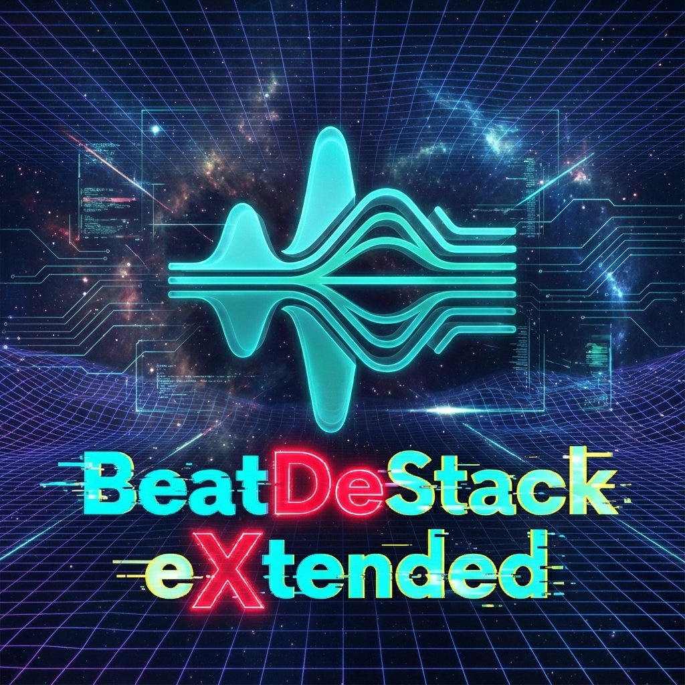

# BeatDeStack Extended v3.7.0

**The Ultimate Offline AI Stem Separation & Audio Enhancement Tool.**

**BeatDeStack Extended** is a professional-grade, locally hosted application designed to separate audio tracks into individual stems (Vocals, Drums, Bass, Guitar, Piano, Other) with studio-quality precision. Powered by state-of-the-art AI models (Demucs v4, MDX-Net, VR Arch), it guarantees complete data privacy, unlimited processing, and a suite of powerful audio enhancement tools—entirely free from subscriptions or cloud-based restrictions.



---

## Features

### Multi-Stem Separation

Choose from a wide range of extraction modes to suit your workflow:

* **2-Stem**: Vocals / Instrumental (Perfect for karaoke or acapellas).
* **4-Stem**: Vocals, Drums, Bass, Other.
* **6-Stem**: Vocals, Drums, Bass, Guitar, Piano, Other.
* **Vocals Only**: Specialized pipeline for pristine acapellas using top-tier models like `Kim_Vocal_2`.
* **Instrumental / Karaoke**: High-quality backing tracks with minimal vocal bleed.

### Audio Enhancement Suite

Polish your stems or clean up recordings directly within the app:

* **De-Reverb**: Remove room ambiance and "wetness" to dry out recordings (Powered by `Reverb_HQ_By_FoxJoy`).
* **De-Echo**: Eliminate slapback delay and echo artifacts.
* **De-Noise**: Clean up background hiss, static, and ambient noise (Powered by `UVR-DeNoise`).
* **Vocal Clarity**: Enhance presence and detail in vocal tracks.
* **Stereo Width**: Expand or narrow the stereo field using Mid-Side processing.

### 🎹 Audio-to-MIDI Export

Turn your audio into editable MIDI notes!

* **Right-Click Export**: Simply right-click any processed stem in the queue and select **"Export as MIDI"**.
* **Powered by Basic Pitch**: Uses Spotify's lightweight and efficient audio-to-MIDI converter.
* **Seamless Integration**: Generates `.mid` files directly in your output folder.

---

---

## Configuration Guide (Right Sidebar)

BeatDeStack Extended puts professional control at your fingertips. Here is a complete breakdown of every option on the right-hand panel, ordered from top to bottom.

### 1. Stem Options

Controls which parts of the audio are extracted.

* **Model Type**: Choose between 2-stem (Vocals/Inst), 4-stem (Vocals/Drums/Bass/Other), or 6-stem (adds Guitar/Piano).
* **Mode**:
  * **Standard**: Normal separation.
  * **Vocals Only**: Runs a specialized "Ultra Clean" pipeline (extract -> subtract -> clean) for studio-grade acapellas.
  * **Instrumental**: Optimized for backing tracks.
  * **Drums/Bass/Guitar**: Extracts only that specific stem to save time.

### 2. Audio Enhancement

Refine your tracks *after* separation (or standalone).

* **De-Reverb**: Uses the `Reverb_HQ` neural network to remove room ambience.
* **De-Echo**: Eliminates slapback delay.
* **De-Noise**: Removes hiss and static (great for old recordings).
* **Stereo Width**: Expands the soundstage (Mid-Side processing). 100% = Original. 200% = Ultra-Wide.

### 3. Quality Mode

Adjusts the precision of **Demucs** models (less effect on MDX-Net).

* **Fast**: Single pass, 10% overlap. Good for quick previews.
* **Balanced**: The default. 1 shift + 25% overlap.
* **Best**: Double pass (2 shifts) + 25% overlap. Reduces artifacts but takes 2x longer.

### 4. Audio Manipulation

Creative tools for remixing.

* **Pitch Shift**: Transpose key by semitones (-12 to +12).
* **Time Stretch**: Change speed (0.5x to 2.0x) without affecting pitch.
* **Split Bands**: Generates 3 extra files for every stem: Low (<300Hz), Mid, and High (>4kHz).

### 5. Output Options

* **Format**: MP3, WAV, FLAC, OGG, AIFF.
* **Sample Rate**: Up to 96kHz.
* **Bit Depth**: 16-bit, 24-bit, or 32-bit Float (for mastering).
* **Export as ZIP**: Zips all stems into a single archive.
* **Export as MIDI**: Converts stems to MIDI notes using Spotify's Basic Pitch.
* **Keep Original**: Saves a copy of the source input in the output folder.

### 6. Advanced Settings

Detailed control for power users.

* **Ensemble Mode**: Run multiple models and average the results for higher quality.
* **Shifts**: (0-10) Number of random time shifts to average.
* **Overlap**: (0.1-0.99) How much segments overlap. Higher = smoother.
* **Segment**: Chunk size. 0 = Auto.
* **Jobs**: CPU threads for Demucs.
* **Batch Size**: GPU batch size (Higher = Faster, more VRAM).
* **Normalization**: Peak volume threshold (Default 0.9).

---

## Included Models & Compatibility

### Default Defaults (Pre-installed)

This package comes pre-loaded with a curated selection of "Best-in-Class" models:

| Model | Type | Best For |
| :--- | :--- | :--- |
| **Kim_Vocal_2.onnx** | MDX-Net | **Vocals**. Premium quality vocal extraction with minimal bleed. |
| **UVR-MDX-NET-Inst_HQ_3.onnx** | MDX-Net | **Instrumentals**. Excellent for creating clean backing tracks. |
| **UVR_MDXNET_Main.onnx** | MDX-Net | **Balanced**. Good all-rounder for general separation tasks. |
| **Reverb_HQ_By_FoxJoy.onnx** | MDX-Net | **De-Reverb**. Removes room sound for dry, studio-like audio. |
| **UVR-DeNoise.pth** | VR Arch | **De-Noise**. Heavy-duty background noise removal. |
| **UVR-DeNoise-Lite.pth** | VR Arch | **De-Noise**. Faster, lighter noise reduction. |
| **UVR-De-Echo-Normal.pth** | VR Arch | **De-Echo**. Removes standard room echo and slapback. |

*Plus standard Demucs v4 models (`htdemucs` family) which are built-in.*

### Other Supported Models

BeatDeStack Extended supports the entire ecosystem of community-trained models. While not pre-installed to keep the download size reasonable, you can download and **Import** any of the following types:

* **BS-Roformer / MelBand Roformer**: The current state-of-the-art for instrumental separation (e.g., `model_bs_roformer_ep_317_sdr_12.9755.ckpt`).
* **MDX23C**: Newer variations of MDX-Net.
* **VR Architecture**: Legacy but highly effective models (e.g., `UVR-DeEcho-Aggressive.pth`).

**How to use custom models:**

1. Download the `.pth`, `.onnx`, or `.ckpt` file.
2. Click **"Import Custom Model"** in the Advanced Settings panel.
3. The model will automatically be moved to your local `models/custom` folder and appear in the list.

---

## 💻 System Requirements

* **OS**: Windows 10/11, macOS 12+ (Apple Silicon), or Linux (Ubuntu 22.04+).
* **RAM**: 8GB minimum (16GB+ recommended for heavy models like 6-stem).
* **Storage**: ~1.5 GB total (Application + Default Models). (~8 GB if all optional models are downloaded).
* **GPU**:
  * NVIDIA GTX 1060 (6GB) or higher recommended.
  * AMD Radeon RX 5000 series or newer (ROCm).
  * Apple M1 or newer.
  * **DirectML**: Experimental support for Intel ARC / AMD / NVIDIA.
  * **CPU Mode**: Works on **any** standard computer (no GPU required). Perfect for laptops or servers without dedicated graphics cards.
  * **CPU Only**: Supported on any Intel/AMD processor (processing will be slower).

---

## Installation & Building

### 1. Clone the Repository

```bash
git clone https://github.com/3453-315h/BeatDeStackExtended.git
cd BeatDeStackExtended
```

### 2. Install Dependencies & Build

Choose the script matching your hardware:

#### Windows (AMD GPU) - *Recommended for Radeon*

This sets up the AMD ROCm environment for hardware acceleration.

```powershell
.\build_amd_rocmsdk.bat
```

#### Windows (NVIDIA CUDA) - *Recommended for GeForce*

Optimized for NVIDIA GPUs (Requires CUDA 12.x).

```powershell
.\build_cuda.bat
```

#### Windows (DirectML) - *Broad Compatibility*

Experimental GPU acceleration for Intel ARC, AMD, and NVIDIA.

```powershell
.\build_directml.bat
```

#### Windows (CPU Only / No GPU)

Ideal for standard laptops or desktops without a dedicated GPU.

```powershell
.\rebuild_cpu_robust.bat
```

#### macOS (Apple Silicon)

```bash
chmod +x build_macos_mps.sh run_macos.sh
./build_macos_mps.sh
```

#### 🐧 Linux (ROCm / CUDA)

```bash
chmod +x build_rocm.sh run_linux.sh
./build_rocm.sh
```

---

## Usage

### Starting the App

* **Windows**: Run the generated `.exe` from the `dist/` folder (e.g., `BeatDeStackExtended_CUDA.exe`).
* **macOS / Linux**: Run `./run_macos.sh` or `./run_linux.sh`.

### Separating Audio

1. **Drag & Drop** your audio file(s) into the main window.
2. Select a **Model** (e.g., `Kim_Vocal_2` for vocals).
3. Choose **Stems** to export (Vocals, Instrumental, etc.).
4. Click **Start Processing**.
5. Files will be saved to the `output` folder by default.

### 🎹 Exporting to MIDI

1. Process an audio file to separate stems.
2. **Right-click** the completed item in the queue.
3. Hover over **"Export as MIDI"** and select the stem you want (e.g., `vocals.wav`).
4. The MIDI file will be saved in the same folder as the stems.

### Enhancing Audio

1. Navigate to the **Audio Tools** or **Enhancement** panel.
2. Load an audio file.
3. Adjust sliders for **De-Reverb**, **De-Noise**, etc.
4. Preview the changes and export.

---

## ❤️ Credits & Acknowledgements

Special thanks to the open-source community:

* **[Spotify](https://github.com/spotify/basic-pitch)**: For the **Basic Pitch** audio-to-MIDI converter.
* **[Anjok07](https://github.com/Anjok07/ultimatevocalremovergui)**: Creator of **Ultimate Vocal Remover (UVR)**.
* **[Meta Research](https://github.com/facebookresearch/demucs)**: Creators of the **Demucs** architecture.
* **[KimberleyJensen](https://huggingface.co/KimberleyJSN)**: For the incredible *Kim Vocal* models.
* **[FoxJoy](https://github.com/fx-joy)**: For the essential *De-Reverb* and *De-Echo* models.
* **[Aufr33](https://github.com/aufr33)** & **[Jarredou](https://github.com/jarredou)**: For their contributions to MDX-Net training.

---

*BeatDeStack Extended • 100% Offline • Private • Powerful*
